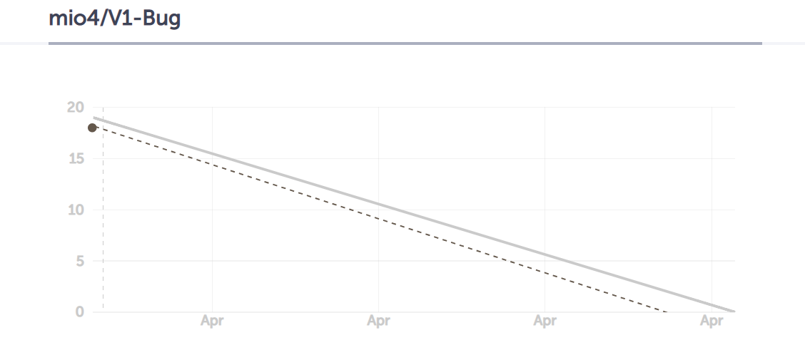

# 第一周总结

## 写在前面

|会议名称|会议时间|会议时长|会议地点|
|:-:|:-:|:-:|:-:|
|第一次周例会|2019/4/1 19:00|70min|F楼2层沙发休息处|

附Github仓库：[WEDO](https://github.com/mio4/V1-Bug)

***

## 例会照片

## 工作情况总结

|人员|上周进度|下周计划|
|:-:|-:|-:|
|魏一|1.完成界面设计文档 2.完成功能设计文档|1.完善功能与界面设计文档|
|张进|1.敲定技术路线，并完成技术文档中技术路线部分的内容 2.完成lnmp环境的配置|1.熟悉php 2.完成登陆和注册后端实现 3.建立数据库，设计相关SQL语句|
|宋卓洋|1.完成web开发相关技术的学习 2.完成环境配置 3.完成技术文档中数据库设计部分内容|1.熟悉php 2.完成登陆和注册后端实现 3.建立数据库，设计相关SQL语句|
|张朝阳|1.完成技术文档功能抽象与路由分发设计的写作|1.熟悉php 2.完成登陆和注册后端实现 3.建立数据库，设计相关SQL语句|
|苗萌|1.完成环境配置 2.完成数据库学习 3.完成界面设计文档|1.熟悉bootstrap框架使用 2.完成登陆和注册前端实现 |
|张沛泽|1.完成功能设计文档异常设计部分的写作|1.熟悉bootstrap框架使用 2.完成登陆和注册前端实现 |

## 本周燃尽图

## 周例会成果

1. 确定了固定例会时间：每周日晚7点
2. 规范了git操作
3. 规范代码风格，注释
4. 确定了下周计划，见工作情况。

## 迁入记录

* 文档迁入记录在[这里](https://github.com/mio4/V1-Bug/commits/master)

***